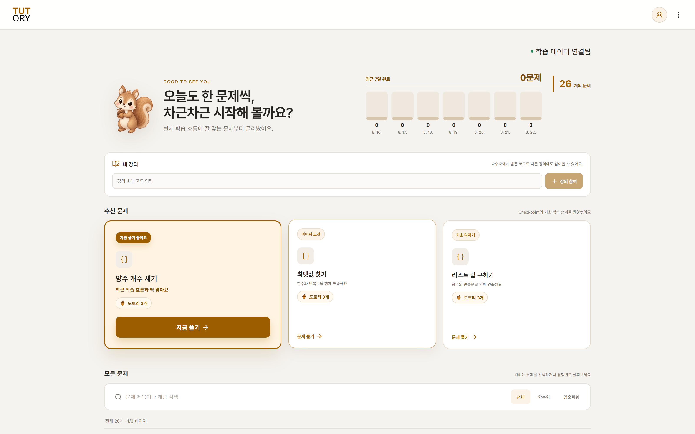
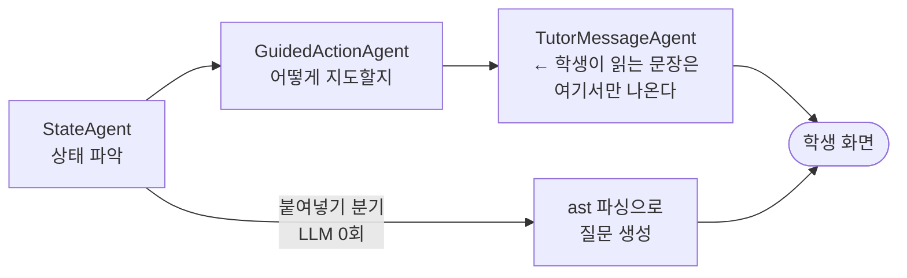

<div align="center">


### 막혔을 때, 정답 대신 다음 한 걸음

정답을 알려주는 도구는 이미 많습니다.<br>
TUTORY는 코드를 쓰는 **과정**을 읽고, 지금 필요한 만큼만 도와줍니다.

<br>

🏆 **AWS 특별상** · 강원대 × 고려대 Summer Agentic AI 심화 몰입 캠프 4팀

</div>

---

## 이런 순간을 위해 만들었습니다

30분째 같은 자리에 멈춰 있습니다. 뭐가 틀렸는지 모르겠고, 물어보긴 애매하고,
검색하면 정답 코드가 통째로 나옵니다. 그걸 붙여넣으면 문제는 넘어가지만
배운 건 없습니다.

기존 도구는 **결과**만 봅니다. 제출해야 반응하고, 막히면 학생이 먼저 손을
들어야 합니다. 그런데 배움이 무너지는 지점은 채점 직후가 아니라 **혼자
헤매는 그 중간**입니다.

TUTORY는 그 중간을 봅니다. 편집, 되돌리기, 같은 자리를 고치고 또 고치는
흔적, 실행 결과의 정체 — 이걸 신호로 읽어서 **막힌 순간에 먼저 말을 겁니다.**

> 💬 지금 `for`문이 `numbers`에서 `n`을 하나씩 꺼내주고 있는데, 그 다음 들여쓴
> 줄이 비어 있어서 문법 오류가 나고 있어요. 일단 `for` 아래에 `pass`라도 써서
> 문법을 완성해볼까요?

정답을 주지 않습니다. 코드를 대신 써주지도 않습니다. **지금 무엇을 확인해야
하는지**를 질문으로 되돌려줍니다.

코드가 한 번에 크게 바뀌면 톤이 달라집니다. 붙여넣었다고 단정하진 않지만,
설명을 요구합니다.

> 💬 코드가 한 번에 많이 바뀌었네요. 3번째 줄 `for` 반복문이 한 바퀴 돌 때마다
> 어떤 값이 어떻게 바뀌나요?

---

## 이렇게 동작합니다

<table>
<tr>
<td width="33%" valign="top">

**01 · 문제를 고르고 코드를 씁니다**

브라우저에서 바로 실행됩니다. 설치할 것은 없습니다.

</td>
<td width="33%" valign="top">

**02 · 과정이 신호로 쌓입니다**

편집과 실행 결과가 정체·반복 실패 같은 신호로 요약됩니다.

</td>
<td width="33%" valign="top">

**03 · 막히면 튜터가 먼저 옵니다**

정답이 아니라 다음 한 걸음을 짚어주는 힌트와 활동이 도착합니다.

</td>
</tr>
</table>

---

## 화면

<div align="center">

</div>

최근 학습 흐름에 맞춰 다음에 풀 문제를 골라줍니다. 문제를 열면 왼쪽에 지문,
가운데 에디터, 오른쪽에 튜터 패널이 붙습니다.

---

## 무엇이 다른가

**막힌 순간을 먼저 알아챕니다.** 편집·실행·제출을 초 단위로 기록해 신호로
바꿉니다. 학생이 도움을 요청하지 않아도 개입 시점을 찾아냅니다.

**잘 풀고 있으면 끼어들지 않습니다.** `2/5 → 3/5 → 4/5`로 나아가는 학생에게는
말을 걸지 않습니다. 진전 중에 끼어드는 튜터는 도움이 아니라 방해입니다.

**코드가 흘러가는 길을 눈으로.** 실행 순서와 변수 변화를 따라가는 트레이스
활동으로, 왜 그 결과가 나왔는지 스스로 설명할 수 있게 만듭니다.

**결과가 아니라 과정의 기록.** 맞았는지 틀렸는지가 아니라 어떻게 도달했는지가
남습니다. 도토리로 꾸준함을 보상하고 성장 과정을 기록합니다.

---

## 기술적으로 재밌었던 것 세 가지

### 1. 개입 시점은 LLM이 정하지 않는다

매 이벤트마다 LLM을 부르면 비용도 지연도 감당이 안 되고, 무엇보다 판단이
재현되지 않습니다. [`monitor.py`](backend/app/trace/monitor.py)는 **LLM을 부르지
않고** 결정론적 규칙 체인만으로 "지금 튜터를 부를까"를 정합니다. LLM은 트리거된
뒤에 "무엇을 말할까"만 담당합니다.

```
Monitor (규칙, LLM 0회)  ──trigger──▶  Agent (LLM, 무엇을 말할지)
```

<details>
<summary>규칙 체인 (first match wins)</summary>

```
R0  HELP_REQUESTED           학생이 직접 요청 (쿨다운 무시)
R1  COOLDOWN GATE            분류는 하되 발화만 막는다
R1s SYSTEM ERROR             채점기 고장이면 판단 보류
R2  UNDERSTANDING_UNCERTAIN  대규모 변경 직후 통과 → 이해도 확인
R3  PROGRESS GUARD           개선 중이면 개입하지 않는다
R4  SOLVED
R5/R6  REPEATED_FAILURE / REPEATED_ERROR
R7  NO_PROGRESS
R7b/R7c  실행을 한 번도 안 누른 학생을 위한 편집 기반 규칙
```

순서 자체가 설계입니다. R3(진전 가드)이 R4 위에 있어야 "잘 풀고 있는 학생을
방해하지 않는다"가 다른 모든 규칙보다 우선합니다.

</details>

### 2. 판단하는 AI와 말하는 AI를 분리했다

처음엔 내부 판단 텍스트가 그대로 학생 화면에 나갔습니다.

> ~~학생은 함수의 기본 구조를 이해하지 못한 채 31분 넘게 완전히 막혀 있습니다.
> 힌트를 6회 요청했지만 이전 두 번의 개입 이후에도 진전이 없습니다.~~

교사가 교무실에서 하는 말을 학생 앞에 튼 셈이었습니다. 지금은 파이프라인이
3단계로 나뉘어 있고, **학생에게 가는 텍스트는 마지막 단계의 출력 하나뿐**입니다.
3인칭 분석은 교육자 타임라인에만 남습니다.



붙여넣기 분기는 LLM을 **한 번도** 부르지 않습니다. 코드를 `ast`로 파싱해
설명을 가장 요구할 만한 구조(재귀 > 컴프리헨션 > `while` > `for` > 분기)를
골라 질문을 만듭니다. 5~6초를 줄였고, 질문은 오히려 더 구체해졌습니다.

### 3. 채점기가 학생 코드를 믿지 않는다

[`judge/`](judge/)는 학생 코드를 Docker 컨테이너에서 실행합니다. 네트워크 차단,
메모리·CPU·PID 제한, read-only 파일시스템, 비루트 실행.

여기에 더해 **하네스가 학생 코드를 자기 프로세스에서 `exec`하지 않습니다.**
테스트케이스마다 자식 프로세스를 새로 띄우고, 자식에게 정답을 넘기지 않습니다.
학생이 가짜 결과를 stdout에 출력한 뒤 `sys.exit()`으로 진짜 채점 결과 출력을
막아 통과 판정을 조작하는 취약점을 실제로 재현한 뒤 고친 구조입니다.

---

## 레포 구조

| 폴더 | 역할 | 스택 | 포트 |
|---|---|---|---|
| [frontend/](frontend/) | 학생·교육자 UI, 에디터, 실시간 개입 표시 | React 18 · TypeScript · Vite · Monaco · Pyodide | 5173 |
| [backend/](backend/) | 세션·이벤트·Monitor·채점 오케스트레이션 | FastAPI · SQLModel · SQLite | 8000 |
| [agent/](agent/) | LLM 튜터 파이프라인 | Python 3.12 · Strands Agents SDK | 8100 |
| [judge/](judge/) | Docker 격리 채점 | Python · docker-py | (라이브러리) |

각 폴더에 자체 README가 있습니다. **설계 근거와 겪은 버그는 대부분 그쪽에**
적혀 있습니다 — 이 문서는 "무엇이고 어떻게 띄우는가"까지만 다룹니다.

그 밖에 만든 것: 문제 26종(`function_call` 3 + `stdout_match` 23, JSON 파일
추가만으로 확장), 교육자 대시보드 API 9종, 도토리 보상과 배지 6종,
JWT 인증(학생·교육자·관리자).

---

## 실행

<details>
<summary><b>전체 스택 띄우기</b> — 프로세스 3개가 필요합니다</summary>

### 사전 준비

```bash
# Docker 데몬이 켜져 있어야 한다
cd judge && docker build -t judge-sandbox .

# agent에 LLM 키
cd agent && cp .env.example .env    # ANTHROPIC_API_KEY 채우기
```

### 프로세스 3개

**backend는 반드시 아래 환경변수와 함께 띄웁니다.** 그냥 `uvicorn`만 돌리면
`JUDGE_BACKEND=none`(기본값)이라 서버 채점이 꺼진 채 뜹니다.

```powershell
# 1) agent — strands는 여기에만 있으면 된다
cd agent
.\.venv\Scripts\python.exe -m uvicorn tutor_agent.service:app --port 8100

# 2) backend
cd backend
$env:PYTHONPATH="../agent/src"; $env:PROBLEMS_DIR="../judge/problems"
$env:JUDGE_BACKEND="docker"; $env:JUDGE_PATH="../judge"
.\.venv\Scripts\python.exe -m uvicorn tutor_agent.backend_entry:app --port 8000

# 3) frontend
cd frontend && npm run dev
```

- `python`이 아니라 `.venv\Scripts\python.exe`를 명시할 것 — 그냥 `python`은
  시스템 3.14를 잡아 `pydantic_settings` 없다고 죽습니다
- 서버 채점이 붙었는지는 UI의 **"Judge API" 배지**로 확인합니다
- `JUDGE_BACKEND=none`이면 프런트가 브라우저 Pyodide로 폴백하는데, 그 경로는
  채점 결과를 서버에 남기지 않습니다. 그러면 Monitor가 학생의 시도를 못 보고
  튜터가 안 불립니다 ("채점은 되는데 튜터가 안 나온다"의 원인)

### agent가 왜 별도 프로세스인가

`strands-agents`가 `starlette 1.6.0`을 끌어오는데 backend의 `fastapi 0.115.6`은
`starlette<0.42.0`을 요구합니다. **backend venv에 `strands-agents`를 설치하면
fastapi가 깨집니다.** 그래서 agent는 자기 venv를 가진 별도 프로세스로 뜨고,
backend는 HTTP로만 부릅니다.

agent 호출의 모든 실패(연결 거부·타임아웃·4xx·5xx·깨진 JSON)는 `WAIT` 폴백입니다.
예외를 던지지 않습니다 — **채점 결과는 agent 실패와 무관하게 반드시 반환되어야
하기 때문**입니다.

### 데모 데이터

```bash
cd backend
python -m scripts.seed_org     # 기관·교수자·학생·강의 (교육자 기능에 필수)
python -m scripts.seed_demo    # 데모 세션 4종
```

### 발표용 실시간 로그

터미널 두 개를 나란히 띄우면 "학생이 막힌다 → Monitor가 감지한다 → 튜터가
말을 건다"가 통째로 보입니다.

```bash
python backend/scripts/watch_trace.py --only AGENT
# + agent 서비스 터미널에 LLM 파이프라인이 단계별로 찍힌다
```

</details>

<details>
<summary><b>테스트</b></summary>

```bash
cd backend  && ./.venv/Scripts/python.exe -m pytest -q     # 277개
cd agent    && ./.venv/Scripts/python.exe -m pytest -q     # 187개 (LLM 호출 없음, 전부 mock)
cd judge    && pytest tests/                               # Docker 필요
cd frontend && npx tsc --noEmit -p tsconfig.app.json && npm run lint && npm run build
```

`backend/tests/test_monitor.py`가 **데모 게이트**입니다. `2/5→3/5→4/5` 미발화 /
`3/5×3` 발화 / syntax error 1회 미발화 — 이 세 시나리오가 초록이 아니면 하류의
어떤 것도 의미가 없습니다.

judge 테스트는 세션 시작 시 **이미지 안의 하네스를 해시로 대조합니다.** 하네스를
고치고 `docker build`를 안 하면 옛 하네스가 조용히 계속 돌기 때문입니다 —
채점기를 망가뜨려도 테스트가 초록으로 나오는 상황을 실제로 겪었습니다.

</details>

<details>
<summary><b>알려진 제약</b></summary>

- `/auth/refresh`가 없습니다. access token 하나만 쓰고 만료되면 다시 로그인합니다
- Alembic을 쓰지 않습니다. 스키마를 바꾸면 `codetrace.db`를 지우고 다시 띄웁니다
- 문제 26종에 `difficulty`가 없어 도토리 보상이 전부 BEGINNER로 수렴합니다
- hidden 테스트케이스가 공개 레포에 원문으로 있습니다 — 캠프 데모용이라 의도한
  것이고, 실제 서비스라면 분리해야 합니다
- `TRACE`/`PREDICT`/`DEBUG`/`VERIFY` 활동은 아직 생성기가 없어 실제 개입이
  전부 힌트로 모입니다

</details>

---

## 팀

<table>
<tr>
<td align="center" width="20%"><b>한은규</b><br><sub>프론트엔드</sub></td>
<td align="center" width="20%"><b>김태연</b><br><sub>프론트엔드</sub></td>
<td align="center" width="20%"><b>김한성</b><br><sub>백엔드</sub></td>
<td align="center" width="20%"><b>윤혜빈</b><br><sub>백엔드</sub></td>
<td align="center" width="20%"><b>신지훈</b><br><sub>AI</sub></td>
</tr>
</table>
