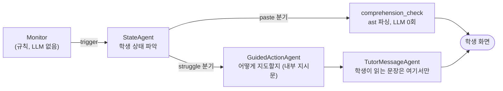

# TUTORY — 코드를 쓰는 **과정**을 읽는 AI 코딩 튜터

> 강원대 × 고려대 Summer Agentic AI 심화 몰입 캠프 4팀
>
> 🏆 **AWS 특별상 수상**

기존 코딩 학습 도구는 **결과**만 본다. 제출하면 맞았는지 틀렸는지를 알려주고,
막히면 학생이 먼저 물어봐야 한다. 그런데 정작 배움이 무너지는 지점은 채점
직후가 아니라 **혼자 30분을 헤매는 그 중간**이다.

TUTORY는 학생이 코드를 쓰는 과정 — 편집, 되돌리기, 같은 자리를 고치고 또
고치는 churn, 실행 결과의 정체 — 을 이벤트로 수집해서, **막힌 순간을 감지하고
먼저 말을 건다.** 정답을 주지 않고 질문을 던지는 것이 원칙이다.

---

## 이 프로젝트의 세 가지 축

### 1. Coding Trace — 과정을 데이터로 만든다

편집 이벤트를 코드 스냅샷과 diff로 쌓고, 이를 19개의 Process Feature로 압축한다
(무진전 시간, 같은 결과 반복 횟수, 같은 영역 재편집 횟수, undo 횟수, 대규모 변경
감지 …). 학생의 화면에서 일어난 일이 그대로 서버에 남고, 교육자 대시보드와
AI 튜터가 같은 데이터를 본다.

### 2. Monitor — 언제 개입할지는 LLM이 정하지 않는다

`backend/app/trace/monitor.py`는 **LLM을 부르지 않는다.** 결정론적 규칙 체인
(first match wins)만으로 "지금 튜터를 부를까"를 정한다. 매 이벤트마다 LLM을
부르면 비용도 지연도 감당이 안 되고, 무엇보다 판단이 재현되지 않는다.

```
R0  HELP_REQUESTED           학생이 직접 요청 (쿨다운 무시)
R1  COOLDOWN GATE            분류는 하되 발화만 막는다
R1s SYSTEM ERROR             채점기 고장이면 판단 보류
R2  UNDERSTANDING_UNCERTAIN  대규모 변경 직후 통과 → 이해도 확인
R3  PROGRESS GUARD           개선 중이면 개입하지 않는다
R4  SOLVED
R5/R6  REPEATED_FAILURE / REPEATED_ERROR
R7  NO_PROGRESS
R7b/R7c  실행을 한 번도 안 누른 학생을 위한 편집 기반 규칙
```

핵심은 **R3(진전 가드)**다. `2/5 → 3/5 → 4/5`로 나아가는 학생에게는 말을 걸지
않는다. 잘 풀고 있는데 끼어드는 튜터는 도움이 아니라 방해다.

### 3. Agent 파이프라인 — 무엇을 말할지는 LLM이 정한다

Monitor가 트리거하면 그때만 agent가 호출된다. 개입 파이프라인은 3단계다.



**판단과 작문을 분리한 것이 이 파이프라인의 요점이다.** 예전엔 내부 판단 텍스트
("학생은 함수의 기본 구조를 이해하지 못한 채 31분 넘게 막혀 있습니다…")가 그대로
학생 화면에 나갔다. 교사가 교무실에서 하는 말을 학생 앞에 튼 셈이었다. 지금은
학생에게 가는 텍스트가 `TutorMessage.message` 하나뿐이고, 3인칭 분석은
교육자 타임라인용 `reason`에만 남는다.

붙여넣기 분기는 **LLM을 한 번도 부르지 않는다.** 코드를 `ast`로 파싱해 설명을
가장 요구할 만한 구조(재귀 > 컴프리헨션 > `while` > `for` > 분기)를 골라
질문을 만든다. 5~6초를 줄였고, 질문도 오히려 구체해졌다.

---

## 그 밖에 만든 것

| | |
|---|---|
| **Docker 격리 채점** | 네트워크 차단, 메모리/CPU/PID 제한, read-only FS, 비루트 실행. 하네스가 학생 코드를 자기 프로세스에서 `exec`하지 않는다 (가짜 결과를 출력하고 `sys.exit()`으로 채점을 조작하는 취약점을 실제로 재현한 뒤 고쳤다) |
| **문제 26개** | `function_call` 3 + `stdout_match` 23. `problems/*.json` 파일 추가만으로 문제가 늘어난다 |
| **교육자 대시보드 API** | 강의·수강생 관리, 학급 현황, 주의가 필요한 학생 탐지 |
| **도토리 보상 시스템** | 문제 해결·활동 완료로 도토리를 모으고 닉네임/아바타에 쓴다. 배지 6종 |
| **인증** | JWT + bcrypt, 역할 3종(학생/교육자/관리자) |

---

## 폴더 구조

| 폴더 | 역할 | 스택 | 포트 |
|---|---|---|---|
| [frontend/](frontend/) | 학생·교육자 UI, Monaco 에디터, 실시간 개입 표시 | React 18 + TypeScript + Vite + Monaco + Pyodide | 5173 |
| [backend/](backend/) | 세션·이벤트·Monitor·채점 오케스트레이션 | FastAPI + SQLModel + SQLite | 8000 |
| [agent/](agent/) | LLM 튜터 파이프라인 | Python 3.12 + Strands Agents SDK | **8100 (별도 프로세스)** |
| [judge/](judge/) | Docker 격리 채점 | Python + docker-py | backend가 in-process import |

각 폴더에 자체 README가 있다. 설계 근거와 겪은 버그는 대부분 그쪽에 적혀 있다.

### ⚠️ agent가 왜 별도 프로세스인가

`strands-agents`가 `starlette 1.6.0`을 끌어오는데 backend의 `fastapi 0.115.6`은
`starlette<0.42.0`을 요구한다. **backend venv에 `strands-agents`를 설치하면
fastapi가 깨진다** (실제로 설치해서 확인했다). 그래서 agent는 자기 venv를 가진
별도 프로세스로 뜨고, backend는 HTTP로만 부른다.

agent 호출의 모든 실패(연결 거부/타임아웃/4xx/5xx/깨진 JSON)는 `WAIT` 폴백이다.
예외를 던지지 않는다 — **채점 결과는 agent 실패와 무관하게 반드시 반환되어야
하기 때문**이다.

---

## 실행

### 사전 준비

```bash
# Docker 데몬이 켜져 있어야 한다
cd judge && docker build -t judge-sandbox .

# agent에 LLM 키
cd agent && cp .env.example .env    # ANTHROPIC_API_KEY 채우기
```

### 프로세스 3개

**backend는 반드시 아래 환경변수와 함께 띄운다.** 그냥 `uvicorn`만 돌리면
`JUDGE_BACKEND=none`(기본값)이라 서버 채점이 꺼진 채 뜬다.

```powershell
# 1) agent (strands는 여기에만 있으면 된다)
cd agent
.\.venv\Scripts\python.exe -m uvicorn tutor_agent.service:app --port 8100

# 2) backend
cd backend
$env:PYTHONPATH="../agent/src"; $env:PROBLEMS_DIR="../judge/problems"
$env:JUDGE_BACKEND="docker"; $env:JUDGE_PATH="../judge"
.\.venv\Scripts\python.exe -m uvicorn tutor_agent.backend_entry:app --port 8000

# 3) frontend
cd frontend && npm run dev
```

- `python`이 아니라 `.venv\Scripts\python.exe`를 명시할 것 — 그냥 `python`은
  시스템 3.14를 잡아 `pydantic_settings` 없다고 죽는다
- 서버 채점이 붙었는지는 UI의 **"Judge API" 배지**로 확인한다
- `JUDGE_BACKEND=none`이면 프런트가 브라우저 Pyodide로 폴백하는데, 그 경로는
  `TEST_RESULT`를 서버에 남기지 않는다. 그러면 Monitor가 학생의 시도를 아예 못
  보고 AI 튜터가 안 불린다 ("채점은 되는데 튜터가 안 나온다"의 원인)

### 데모 데이터

```bash
cd backend
python -m scripts.seed_org     # 기관·교수자·학생·강의 (교육자 기능에 필수)
python -m scripts.seed_demo    # 데모 세션 4종 (trace 파이프라인 확인용)
```

### 발표용 실시간 로그

터미널 두 개를 나란히 띄우면 "학생이 막힌다 → Monitor가 감지한다 → 튜터가 말을
건다"가 통째로 보인다.

```bash
python backend/scripts/watch_trace.py --only AGENT   # trace 스트림
# + agent 서비스를 띄운 터미널에 LLM 파이프라인 내부가 단계별로 찍힌다
```

---

## 실시간 개입 흐름

```
편집(800ms debounce) → flush(2s) → POST /events
                                       │
프런트가 5초마다 POST /heartbeat → Monitor 재평가
                                       │ triggered?
                                       ▼
                       BackgroundTasks로 agent HTTP 호출 (응답은 즉시 반환)
                                       │
                                 AGENT_INTERVENTION 이벤트 저장
                                       ▲
                   프런트가 2.5초마다 GET /events 폴링해서 화면에 표시
```

체감 지연을 줄인 두 가지:

- **붙여넣기 분기는 LLM을 안 부른다** (`ast` 파싱) → 5~6초 제거
- **낙관적 인디케이터.** 하트비트 응답의 `triggered`를 보고 프런트가 즉시 "코드를
  살펴보고 있어요"를 띄운다. 힌트가 오면 말풍선으로 교체되고, agent가 WAIT이면
  35초 뒤 스스로 꺼진다

---

## 테스트

```bash
cd backend  && ./.venv/Scripts/python.exe -m pytest -q     # 277개
cd agent    && ./.venv/Scripts/python.exe -m pytest -q     # 187개 (LLM 호출 없음, 전부 mock)
cd judge    && pytest tests/                               # Docker 필요
cd frontend && npx tsc --noEmit -p tsconfig.app.json && npm run lint && npm run build
```

`backend/tests/test_monitor.py`가 **데모 게이트**다. `2/5→3/5→4/5` 미발화 /
`3/5×3` 발화 / syntax error 1회 미발화 — 이 세 시나리오가 초록이 아니면 하류의
어떤 것도 의미가 없다.

judge 테스트는 세션 시작 시 **이미지 안의 하네스를 해시로 대조한다.** 하네스를
고치고 `docker build`를 안 하면 옛 하네스가 조용히 계속 돌기 때문이다 (채점기를
망가뜨려도 테스트가 초록으로 나오는 상황을 실제로 겪었다).

---

## 팀

| 이름 | 파트 |
|---|---|
| 한은규 | 프론트엔드 |
| 김태연 | 프론트엔드 |
| 김한성 | 백엔드 |
| 윤혜빈 | 백엔드 |
| 신지훈 | AI |

---

## 알려진 제약

- `/auth/refresh`가 없다. access token 하나만 쓰고 만료되면 다시 로그인한다
- Alembic을 쓰지 않는다. 스키마를 바꾸면 `codetrace.db`를 지우고 다시 띄운다
- judge 문제 26개에 `difficulty`가 없어 도토리 보상이 전부 BEGINNER로 수렴한다
- hidden 테스트케이스가 공개 레포에 원문으로 올라가 있다 — 캠프 데모용이라
  의도한 것이고, 실제 서비스라면 분리해야 한다
- `AgentAction`의 `TRACE`/`PREDICT`/`DEBUG`/`VERIFY`는 아직 생성기가 없어
  실제 개입은 전부 `HINT`로 모인다
