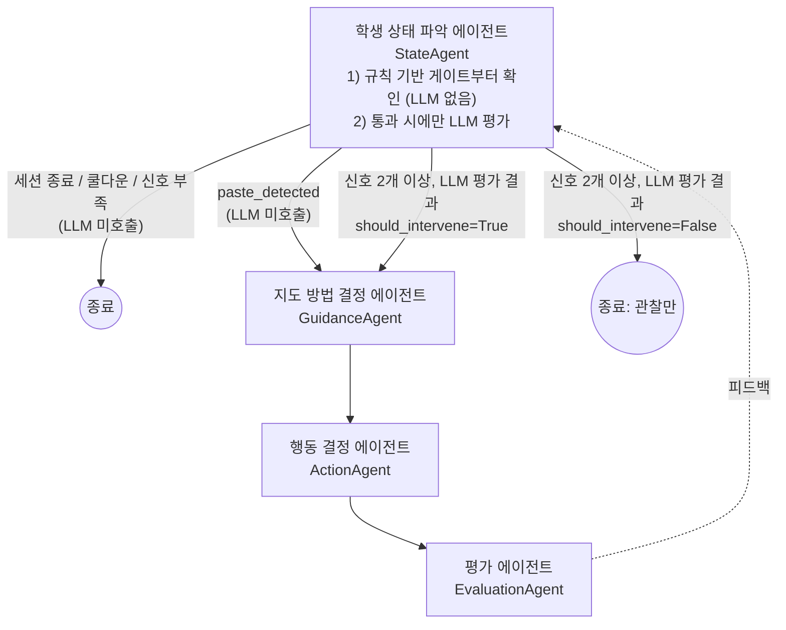

# CodeTrace / TUTORY Agent (초안)

학생이 문제를 푸는 동안 상태를 파악해 "언제, 어떻게 개입할지" 결정하고,
실제 행동을 실행한 뒤 결과를 평가하는 멀티에이전트 파이프라인 초안입니다.

- 언어/스택: **Python 3.12 + [Strands Agents SDK](https://strandsagents.com)**
- 실행 환경: **로컬 에이전트.** AWS(Bedrock) 같은 클라우드 인프라 없이, 각자 발급받은
  API 키로 LLM을 직접 호출하는 것을 기본값으로 합니다.
- LLM 프로바이더: **아직 미정.** 기본값은 Anthropic 다이렉트 API 이지만, `Agent(model=...)`
  자리만 비워두고 어떤 프로바이더로 바뀌어도 나머지 코드는 건드리지 않도록
  [`src/tutor_agent/models.py`](src/tutor_agent/models.py)에서 환경변수로 스위칭하게
  만들어 뒀습니다. (Anthropic / OpenAI / LiteLLM(로컬 Ollama 포함) 준비, 필요하면
  Bedrock으로도 옵트인 가능)

> 이 폴더는 아이디어 스케치를 코드로 옮긴 **초안**입니다. 각 에이전트의 프롬프트,
> 개입 기준, 파이프라인 분기 조건은 팀 논의로 계속 다듬어야 합니다.

## 아키텍처

### (참고용, 지금은 다름) 원래 설계 스케치

```
진입시점 결정 에이전트
        |
        문제 풀이시 학생의 상태를 파악하는 에이전트 : 개입시점 결정 -> 개입시 어떻게 지도할지 에이전트
        결정을 했을 때 무엇을 해야하는지 결정하는 에이전트 -> 평가하는 에이전트
```

원래는 진입시점도 별도의 EntryAgent(LLM)가 판단했지만, StateAgent와 사실상 같은
질문("지금 뭔가 해야 하나?")을 LLM 호출 2번으로 나눠 묻는 구조였고, EntryAgent의
판단 기준("마지막 개입 이후 충분한 시간이 지났는가", "세션이 끝났는가")을 계산할
필드 자체가 `SessionContext`에 없어 실제로는 판단이 불가능했습니다. 그래서
**지금은 진입시점 판단을 별도 에이전트/모듈로 두지 않고 `agents/state_agent.py`
안에 규칙 기반 게이트(LLM 없음, 공짜)로 흡수**했습니다: 게이트를 통과한 경우에만
`state_agent.assess()`가 LLM을 호출합니다. 체크 주기마다 대부분 "아직 개입
아님"으로 끝나기 때문에 LLM 호출 절감 효과가 큽니다.

붙여넣기(`paste_detected`)는 "막힘" 신호가 아니라 성격이 달라(외부에서 답을 그대로
복사했을 수도 있음), 힌트 분기가 아닌 **"이해도 확인" 분기**로 별도 처리합니다.
게이트가 이를 감지하면 `state_agent.assess()`는 LLM을 호출하지 않고 곧장
`entry_branch="paste"`인 `StudentState`를 만들어 GuidanceAgent로 넘기고,
GuidanceAgent가 "이 코드가 왜 이렇게 동작하는지 생각해볼래요?" 같은 질문을
만들게 합니다.

### 지금 구조 (커밋 기준)



| 단계 | 모듈 | 역할 | 출력(Pydantic) |
|---|---|---|---|
| 1 | `agents/state_agent.py` | 규칙 기반 게이트로 먼저 거르고, 통과 시에만 LLM으로 학생 상태 파악 + 개입시점 결정 | `StudentState` |
| 2 | `agents/guidance_agent.py` | 개입한다면 어떻게 지도할지 결정 | `GuidancePlan` |
| 3 | `agents/action_agent.py` | 지도 방침이 정해졌을 때 실제로 무엇을 할지 결정 | `ActionPlan` |
| 4 | `agents/evaluation_agent.py` | 실행한 행동의 결과를 평가 | `Evaluation` |

공통 입력은 `schemas.py`의 `SessionContext`(학생 id, 문제 id, 현재 코드, 실행 기록,
경과/유휴 시간, 마지막 에러 등)이며, 각 단계는 이전 단계의 구조화된 출력을 이어받습니다.
`StudentState.entry_branch`(`struggle` / `paste` / `skip`)를 보면 이 판단이 규칙
게이트의 어느 경로로 나왔는지 알 수 있습니다.

### `state_agent.py`의 규칙 기반 게이트 조건

신호 하나만으로 트리거하면 오탐이 많습니다(예: 유휴 60초는 그냥 문제를 읽는
중일 수도 있음). **아래 신호 중 2개 이상(`STATE_GATE_MIN_STRUGGLE_SIGNALS`)이
겹칠 때만** LLM 평가로 넘어갑니다(`struggle` 분기). 붙여넣기(`paste`)는 예외적으로
그 자체만으로 통과합니다(단, LLM은 호출하지 않습니다).

| 신호 | 조건 (기본값) | 근거 필드 |
|---|---|---|
| `idle` | 유휴 60초 이상 | `idle_seconds` |
| `cursor_stuck` | 같은 블록에 90초 이상 정체 | `cursor_stuck_seconds` (프런트 계산) |
| `edit_churn` | 같은 부분 작성→삭제 3회 이상 | `edit_churn_count` (프런트 계산) |
| `repeated_failure` | Run/Submit 연속 동일 실패 2회 이상 | `run_history` |

그 외에도 다음 조건이면 무조건 LLM 호출 없이 스킵합니다:
- `session_ended=True` (세션 종료)
- `seconds_since_last_intervention`이 쿨다운(기본 300초) 미만 (너무 잦은 개입 방지)

임계값은 모두 `.env`의 `STATE_GATE_*` 환경변수로 조정할 수 있습니다
(`.env.example` 참고).

> **힌트 버튼**(학생이 직접 요청)은 이 자동 게이트와 무관하게 항상 살려두는 것을
> 권장합니다 — 자동 감지가 놓쳐도 학생이 스스로 요청할 수 있는 탈출구입니다.
> (버튼 자체는 backend/frontend 쪽 구현이며 이 파이프라인은 자동 개입만 다룹니다.)

## backend 연결 (`AgentProtocol`)

backend는 `backend/app/agent/interface.py`에서 이미 계약을 정해뒀습니다.

```python
class AgentProtocol(Protocol):
    name: str
    def decide(self, ctx: AgentContext) -> AgentDecision: ...
```

이 계약을 만족하는 어댑터가 **`src/tutor_agent/backend_adapter.py`의
`TutorAgentAdapter`** 입니다. agent/는 backend 코드를 import하지 않고
(`app.*` 의존성 없음), `AgentAction` / `AgentContext` / `AgentDecision`을
**필드명·enum 값 그대로 미러링**합니다. backend 라우터는 `decision.action.value`
(str)만 읽으므로 우리 enum이 backend enum과 다른 클래스여도 동작합니다.
미러가 어긋나면 `tests/test_backend_adapter.py`가 backend 소스를 텍스트로 파싱해
비교하다가 실패합니다 (backend를 import하지는 않습니다).

> ### ⚠️ 먼저 읽으세요: 같은 프로세스에 넣는 길은 막혀 있습니다
>
> 아래 "연결 방법 A/B"는 둘 다 **backend 프로세스 안에서** 파이프라인을 돌리는
> 방식인데, 그러려면 backend venv에 `strands-agents`가 있어야 합니다. 그게
> **불가능합니다**:
>
> ```
> strands-agents 1.52.0   ->  starlette 1.6.0 을 끌어온다
> backend fastapi 0.115.6 ->  starlette<0.42.0 을 요구한다
> ```
>
> 실제로 설치해서 확인했습니다 — 설치하면 backend가 깨지고, 설치하지 않으면
> 첫 `decide()`에서 `ModuleNotFoundError: No module named 'strands'`가 나서
> 어댑터 폴백에 걸려 **항상 WAIT만** 반환합니다(= 사실상 미연결).
>
> **그래서 지금 쓰는 배선은 아래 "연결 방법 C: 별도 프로세스 + HTTP"입니다.**
> A/B는 이 의존성 충돌이 해소되는 날을 위해 남겨둡니다.

### 연결 방법 C: 별도 프로세스 + HTTP (**현재 사용 중**)

agent를 자기 venv를 가진 **별도 프로세스**로 띄우고, backend는 HTTP로만 부릅니다.
judge가 `main.py`로 자기 로직을 감싸 노출하는 것과 같은 패턴입니다.

```bash
# 터미널 1 — agent 서비스 (자기 venv, strands 여기에만 있으면 됨)
cd agent
python -m uvicorn tutor_agent.service:app --port 8100

# 터미널 2 — backend (strands 불필요, httpx로 부르기만 함)
cd backend
PYTHONPATH=../agent/src python -m uvicorn tutor_agent.backend_entry:app --port 8000
```

`backend_entry.install()`이 `get_agent`를 `http_client.HttpAgentClient`로 치환하고,
기동 시 `GET /health`로 서비스가 떠 있는지 확인해 로그를 남깁니다.
(`AGENT_WIRING=inprocess`로 두면 예전 A/B 방식인 `TutorAgentAdapter`를 씁니다.)

#### 서비스 API 계약 (`src/tutor_agent/service.py`)

| 메서드 | 경로 | 요청 | 응답 |
|---|---|---|---|
| GET | `/health` | — | `{"status":"ok","service":"tutor_agent","agent":"tutor_agent"}` |
| POST | `/decide` | backend `AgentContext` 필드 그대로 | backend `AgentDecision` (`action`은 문자열) |
| POST | `/generate-problem` | `ReviewRequest` | `ValidationReport` (judge 검증 통과분만) |

`/decide`는 **5xx를 내지 않습니다.** 파이프라인이 어떻게 실패하든 파싱 가능한
WAIT 결정을 돌려줍니다. 전 필드에 기본값이 있어 backend가 `AgentContext`에
필드를 추가해도 422로 떨어지지 않습니다.

`/generate-problem`은 실시간 개입 경로가 **아닙니다** (오답 기반 복습 문제 생성).
LLM 생성 + judge 샌드박스 실행이라 오래 걸리므로 채점 응답 경로에 끼워넣지 마세요.
아직 호출자가 없고, 나중에 붙일 때 서비스 구조를 다시 손대지 않으려고 미리 열어뒀습니다.

#### 환경변수 (backend 프로세스 쪽)

| 변수 | 기본값 | 뜻 |
|---|---|---|
| `AGENT_SERVICE_URL` | `http://localhost:8100` | agent 서비스 주소 |
| `AGENT_SERVICE_TIMEOUT_SECONDS` | `45` | 읽기 타임아웃 (아래 지연 시간 참고) |
| `AGENT_SERVICE_CONNECT_TIMEOUT_SECONDS` | `0.5` | 연결 타임아웃 (서비스가 꺼져 있을 때 빨리 포기) |
| `AGENT_WIRING` | `http` | `http` \| `inprocess` |

#### ⏱️ 지연 시간 — **팀 결정이 필요합니다**

로컬 실측 (Anthropic 다이렉트 API):

| 상황 | `POST /sessions/{id}/submit` 응답 시간 |
|---|---|
| 평범한 제출 (Monitor 미발화) | **3.3 ~ 3.5초** (agent 호출 없음) |
| Monitor 발화 → agent 호출 | **32초** |

파이프라인이 LLM을 4번 순차 호출(state → guidance → action → evaluation)하기
때문입니다. 대부분의 제출은 agent를 아예 안 부르므로 영향이 없지만, 발화된
순간의 30초는 학생 입장에서 깁니다.

근본 해결은 **"채점 결과는 즉시 반환하고 agent 결정은 별도 채널로 나중에 전달"**
인데, backend 라우터와 frontend 수신부를 같이 고쳐야 해서 agent/ 혼자 정할 수
없습니다. 그때가 오면 `http_client`는 그대로 두고 호출 지점만 백그라운드로
옮기면 됩니다.

코드 수정 없이 가능한 중간 완화책:
- `evaluation` 단계는 결정을 바꾸지 않고 메타데이터만 붙입니다
  (`backend_adapter.to_agent_decision` 참고). 빼면 약 1/4가 줄어듭니다.
- `AGENT_SERVICE_TIMEOUT_SECONDS`를 낮추면 "느리면 그냥 WAIT"로 흘려보냅니다 —
  개입을 포기하는 대신 응답 속도를 지키는 선택입니다.

### 연결 방법 A: backend에서 한 줄 (⛔ 지금은 불가 — 위 의존성 충돌 참고)

`backend/app/agent/__init__.py::get_agent()`의 폴백 분기에 `llm` 분기를 넣으면 됩니다.

```python
def get_agent() -> AgentProtocol:
    backend = get_settings().agent_backend
    if backend == "llm":
        try:
            from tutor_agent.backend_adapter import get_backend_agent

            return get_backend_agent()  # lru_cache 싱글턴
        except Exception:  # tutor_agent 미설치 등
            log.exception("tutor_agent 로드 실패. WaitAgent로 폴백합니다.")
            return WaitAgent()
    return WaitAgent()
```

각 줄의 근거 (그대로 안 써도 되지만, 안 지키면 생기는 문제):

- **`try`로 감싸는 이유는 `import` 하나 때문입니다.** `get_agent()`는 FastAPI
  `Depends`라 라우터 본문보다 먼저, `post_result()`의 try/except **바깥에서**
  평가됩니다(backend 자신의 docstring이 명시). agent/와 backend/는 별도 venv라
  backend에 `tutor_agent`가 설치돼 있지 않으면 `ModuleNotFoundError`가 나고,
  그러면 `POST /results`가 500이 되어 채점 결과까지 유실됩니다. 반대로
  `get_backend_agent()` 호출 자체는 속성 2개를 대입할 뿐이라 현실적으로
  던지지 않습니다 — `except`는 사실상 import 보험입니다.
- **`get_backend_agent()`(싱글턴)를 쓰는 이유.** `TutorAgentAdapter()`를 직접
  부르면 요청마다 새 인스턴스가 생기고, 인스턴스에 캐시된 `TutorPipeline`
  (strands `Agent` 4개)도 첫 `decide()`마다 다시 만들어집니다. 어댑터는 상태를
  갖지 않으니 공유해도 안전합니다. 모듈 최상단에서 import해 두고 재사용하는
  방식도 동등하게 괜찮습니다 — 그 경우 import 실패가 앱 기동 실패가 되므로
  try/except는 여전히 필요합니다.

`TutorAgentAdapter()` 생성은 아무것도 하지 않습니다(무거운 `TutorPipeline`은 첫
`decide()` 호출 때 lazy 생성). `backend_adapter` 모듈 자체는 `strands`를 import
시점에 끌어오지 않으므로, backend venv에 `strands-agents`가 없어도 import는
성공하고 실패는 WAIT 폴백으로만 나타납니다 (`sys.modules['strands'] = None`으로
차단한 상태에서 import 성공 + `decide() → WAIT`을 확인했습니다).

### 연결 방법 B: backend를 **한 줄도 안 고치고** 띄우기 (⛔ in-process 부분은 지금은 불가)

> 아래 설명의 `dependency_overrides` **배선 자체는 지금도 그대로 쓰고 있습니다** —
> 방법 C가 바로 이 진입점(`backend_entry.py`)을 재사용합니다. 다만 치환해 넣는
> 대상이 in-process `TutorAgentAdapter`가 아니라 `HttpAgentClient`로 바뀌었습니다
> (`AGENT_WIRING` 기본값 `http`). 아래 "B의 함정"은 C에도 그대로 적용됩니다.

`backend/app/agent/__init__.py`를 지금 당장 못 고치는 상황(권한/PR 순서/충돌 회피)이면,
FastAPI의 `dependency_overrides`로 같은 결과를 낼 수 있습니다. 고치는 것은
backend 소스가 아니라 **uvicorn이 띄우는 모듈 이름**뿐입니다.

```bash
cd backend
# agent를 backend venv에 설치했다면 PYTHONPATH 없이 그냥 실행
PYTHONPATH=../agent/src uvicorn tutor_agent.backend_entry:app --reload
```

`src/tutor_agent/backend_entry.py`가 `app.main:app`을 가져와
`app.dependency_overrides[get_agent] = get_backend_agent`만 얹어 돌려줍니다.
라우터/미들웨어/DB/에러 핸들러는 backend가 만든 그대로입니다.

실제로 이렇게 띄우고 `POST /agent/decide`를 호출하면 응답이 이렇게 나옵니다
(파이프라인을 stub으로 바꿔 LLM 없이 확인한 결과):

```json
{"state": "PROGRESSING", "concept": "loop", "action": "HINT",
 "reason": "같은 오류를 반복하고 있습니다. (지도 방식: 소크라테스식 질문/hint)",
 "activity": {"kind": "hint", "message": "합을 담는 변수는 언제 초기화해야 할까요?",
              "hint_level": "hint", "action_type": "send_message", "...": "..."}}
```

**그래도 A를 권하는 이유** (B의 함정):

- `uvicorn app.main:app`으로 띄우는 사람(다른 팀원, Docker `CMD`, 배포 스크립트,
  IDE 런 설정)은 override를 못 받고 **조용히 `WaitAgent`로 돌아갑니다.** 실행
  명령이 사실상 계약이 되는데, 이건 코드에 안 적혀 있습니다.
- backend의 pytest(`tests/conftest.py`)는 `app.main:app`을 직접 쓰고
  `get_agent`를 `WaitAgent`로 override하므로, B로는 backend 테스트에서 어댑터가
  절대 안 걸립니다(테스트를 깨지 않는다는 장점이기도 합니다).
- `dependency_overrides`는 원래 테스트용으로 문서화된 훅입니다. 동작은 동일하지만
  프로덕션 배선을 테스트 훅으로 하는 셈입니다.
- `/health`의 `agent_backend`는 backend 설정을 그대로 보여주므로, B로 띄운 사실은
  기동 로그(`INFO ... get_agent에 연결했습니다`)로만 확인됩니다.

즉 **B는 "지금 당장 눈으로 보고 싶다 / 데모까지 버텨야 한다"용 임시 배선**,
A는 최종 배선입니다. `install(app, respect_setting=True)`로 부르면 B도
`AGENT_BACKEND=llm`일 때만 치환합니다. B에서도 연결 실패는 앱 기동을 막지 않고
경고 로그 + `WaitAgent` 유지로 끝납니다.

### 실행 전제 조건

1. backend venv에서 `tutor_agent`가 import 가능해야 합니다.
   ```bash
   # backend venv 활성화 상태에서
   pip install -e ../agent          # 또는 PYTHONPATH=../agent/src
   ```
   `strands-agents[anthropic]` 등 LLM 의존성이 함께 설치됩니다. 설치하지 않으면
   어댑터는 항상 WAIT을 돌려줍니다(에러는 로그로만).
2. backend 프로세스 환경에 LLM 키가 있어야 합니다: `ANTHROPIC_API_KEY`
   (또는 `MODEL_PROVIDER`에 맞는 키). `models.py`가 `python-dotenv`로 `.env`를
   읽지만, 이건 **backend 프로세스의 작업 디렉터리** 기준이므로 backend의
   `.env`나 셸 환경변수에 넣는 편이 확실합니다.
3. backend 설정 `AGENT_BACKEND=llm` (기본값은 `none` → `WaitAgent`).

### 계약 변환 규칙

`AgentContext` → `SessionContext` (`to_session_context()`). 1:1이 아닌 곳만:

| `SessionContext` | 출처 | 비고 |
|---|---|---|
| `student_id` | `session_id` | backend 계약은 세션 단위라 학생 id가 없습니다 |
| `problem_id` | `problem["problem_id"]` | |
| `code` | `current_code` | |
| `run_history` | `recent_trace` + `judge_result` 요약 1줄 | judge 요약은 `"1/4 tests passed"` 포맷을 유지합니다 (`state_agent`의 실패 판별이 `N/M`을 읽습니다) |
| `elapsed_seconds` | `features["elapsed_seconds"]` | |
| `idle_seconds` | `features["seconds_without_progress"]` | 키 입력 유휴가 아니라 "결과 진전 없음" 시간 — backend가 주는 가장 가까운 신호 |
| `edit_churn_count` | `features["same_region_edit_count"]` | 같은 영역 반복 수정 = churn |
| `cursor_stuck_seconds` | `0.0` | backend는 커서 위치를 추적하지 않습니다 |
| `paste_detected` | `trigger`/`process_status == "UNDERSTANDING_UNCERTAIN"` | backend R2(대규모 변경 직후 통과) = agent의 "이해도 확인" 분기와 같은 의미 |
| `last_error` | `features["recent_error_types"][-1]` 또는 에러 status | |
| `session_ended` | `False` | backend는 세션이 살아 있을 때만 호출합니다 |
| `seconds_since_last_intervention` | `None` | backend ctx는 개입 이력의 `seq`만 줍니다(초 없음). 쿨다운은 backend Monitor가 이미 적용 |
| `backend_signals` | ctx 전체 요약 | 위 표로 표현되지 않는 신호(`trigger`, `evidence`, `features` 전체, 문제 설명, 이전 개입)를 담아 **LLM 프롬프트까지 그대로** 전달합니다 |

`PipelineResult` → `AgentDecision` (`to_agent_decision()`):

| agent | backend | |
|---|---|---|
| `should_intervene=False` | `action=WAIT`, `activity=None` | |
| `action_type="no_op"` | `action=WAIT` | |
| `action_type="send_message"` / `"highlight_code"` / `"show_example"` | `action=HINT` | 표에 없는 값도 HINT로 수렴 |
| — | `state` | agent 문장이 아니라 **backend `ProcessStatus` 값**(`ctx.process_status`)을 그대로 돌려줍니다. timeline/교육자 화면이 파싱할 수 있어야 하므로 |
| `problem["concepts"][0]` | `concept` | |
| `StudentState.state_summary` (+ 지도 방식) | `reason` | |
| `GuidancePlan` / `ActionPlan` / `Evaluation` | `activity` | `{"kind": "hint", "message": ..., "hint_level": ..., "action_type": ..., "payload": ..., "urgency": ..., "evaluation": {...}}` — 학생에게 보여줄 문구는 `activity["message"]` |

`TRACE`/`PREDICT`/`DEBUG`/`VERIFY`는 아직 매핑하지 않습니다. agent/에 해당 학습
활동(Activity)을 생성하는 로직이 없어서, 없는 활동을 만들어 보내는 대신 실제 개입을
전부 HINT로 모읍니다. 활동 생성기가 붙으면
`backend_adapter.ACTION_TYPE_TO_AGENT_ACTION`만 넓히면 됩니다.

### 두 가지 안전 장치

- **게이트 이중 판정 방지.** 어댑터는 `TutorPipeline.run(ctx, skip_gate=True)`로
  호출합니다. backend Process Monitor가 자기 규칙으로 이미 "지금이 개입 시점"이라고
  판단해서 우리를 부른 것이므로, `state_agent`의 게이트가 다른 기준(예: backend
  `same_region_edit_count` vs 우리 `edit_churn_count`)으로 재판정하다가 Monitor의
  판단을 조용히 WAIT로 덮어쓰는 일을 막습니다. (붙여넣기/이해도 확인 분기는
  `skip_gate=True`에서도 그대로 확인합니다.)
- **`decide()`는 예외를 던지지 않습니다.** LLM 실패, 네트워크 오류, 필드 누락,
  스키마 검증 실패, `strands` 미설치 — 전부 `AgentAction.WAIT` 폴백 + 로그입니다.
  backend에서 이 값은 채점 응답(`POST /results`)과 같은 경로에 실려 나가므로,
  Agent 실패가 채점 결과를 깨뜨려선 안 됩니다(backend_plan §14).

## 폴더 구조

```
agent/
├── src/tutor_agent/
│   ├── schemas.py        # 파이프라인 전체가 공유하는 Pydantic 모델
│   ├── models.py         # 모델 프로바이더 스위치 (env var 기반, 미정 상태 대응)
│   ├── orchestrator.py   # 4개 에이전트를 잇는 TutorPipeline
│   ├── service.py         # ★ agent를 별도 프로세스로 노출하는 HTTP 서비스 (현재 배선)
│   ├── http_client.py     # ★ backend가 위 서비스를 부르는 AgentProtocol 클라이언트
│   ├── backend_adapter.py # backend AgentProtocol 어댑터 (계약 미러 + 변환 + WAIT 폴백)
│   ├── backend_entry.py   # backend 무수정 진입점 (get_agent를 위 둘 중 하나로 치환)
│   ├── agents/            # 에이전트별 시스템 프롬프트 + build_agent()/실행 함수
│   │   ├── state_agent.py # 규칙 기반 진입 게이트(LLM 없음) + 학생 상태 파악(LLM)
│   │   └── problem_generator_agent.py  # 오답/복습 기반 문제 생성 (judge로 검증)
│   └── tools/             # 에이전트가 쓸 Strands @tool 함수
│       └── judge_validator.py          # judge 샌드박스로 생성 문제 검증
├── examples/run_session_demo.py   # 전체 파이프라인 실행 예시 (struggle/skip/paste 3종)
├── tests/
│   ├── test_state_agent.py      # 규칙 게이트 + assess() 분기 테스트 (LLM 없음, mock)
│   ├── test_orchestrator.py     # 분기 로직 스모크 테스트 (LLM 호출 없이 mock)
│   ├── test_backend_adapter.py  # backend 계약 변환/폴백 + 미러 드리프트 검사 (mock)
│   ├── test_service.py          # HTTP 서비스 계약 (5xx 안 냄, 필드 누락 허용)
│   ├── test_http_client.py      # 모든 실패 모드 -> WAIT 폴백 (MockTransport)
│   └── test_problem_generator*.py  # 문제 생성 (mock + 실제 judge/Docker 통합)
├── pyproject.toml
└── .env.example
```

## 실행

```bash
cd agent
python3.12 -m venv .venv && source .venv/bin/activate
pip install -e ".[dev]"          # 기본: Anthropic 다이렉트 API 클라이언트 포함, AWS 불필요
# 다른 프로바이더를 쓴다면 extra를 같이 설치:
#   pip install -e ".[dev,openai]"
#   pip install -e ".[dev,litellm]"   # Ollama 등 완전 로컬 모델 포함

cp .env.example .env   # ANTHROPIC_API_KEY 등 API 키 채우기
python -m examples.run_session_demo
```

`.env`는 `models.py`가 import되는 시점에 `python-dotenv`로 자동 로드됩니다.
셸에서 `export`할 필요 없이 파일에 값만 채워두면 됩니다.

테스트(LLM 호출 없이 파이프라인 분기만 검증):

```bash
pytest
```

### 전체 스택 띄우기 (프론트에서 힌트까지 보려면)

프로세스가 **3개** 필요합니다. 하나라도 빠지면 조용히 기능만 사라지므로
(예: agent 서비스가 없으면 힌트가 안 나오고 WAIT만 나옴) 순서대로 확인하세요.

| # | 무엇 | 명령 | 포트 |
|---|---|---|---|
| 1 | agent 서비스 | `cd agent && python -m uvicorn tutor_agent.service:app --port 8100` | 8100 |
| 2 | backend | `cd backend && PYTHONPATH=../agent/src python -m uvicorn tutor_agent.backend_entry:app --port 8000` | 8000 |
| 3 | frontend | `cd frontend && npm run dev` | 5173 |

전제 조건:

- **Docker 데몬이 켜져 있고** judge 샌드박스 이미지가 빌드돼 있어야 합니다
  (`cd judge && docker build -t judge-sandbox .`). backend `.env`에
  `JUDGE_BACKEND=docker`, `PROBLEMS_DIR=../judge/problems`.
- backend venv에는 `docker` SDK가 필요합니다 (`pip install "docker>=7.0"`).
  **`strands-agents`는 절대 설치하지 마세요** — backend가 깨집니다
  (위 "먼저 읽으세요" 참고).
- agent `.env`에 `ANTHROPIC_API_KEY`가 있어야 실제 힌트가 나옵니다. 없으면
  파이프라인이 실패하고 WAIT로 폴백합니다 (채점은 정상 동작).

배선이 제대로 됐는지는 각 서버의 기동 로그로 확인합니다:

```
# agent 서비스
INFO:     Uvicorn running on http://127.0.0.1:8100

# backend — 이 두 줄이 같이 나와야 연결된 것
INFO:tutor_agent.backend_entry:tutor_agent 서비스(http://localhost:8100)를 get_agent에 연결했습니다.
INFO:httpx:HTTP Request: GET http://localhost:8100/health "HTTP/1.1 200 OK"
```

agent 서비스가 안 떠 있으면 backend가 기동 시 경고를 남기고, 개입 결정은
전부 WAIT로 폴백합니다 (채점은 영향 없음).

## 모델 프로바이더를 아직 안 정했을 때

`src/tutor_agent/models.py`의 `get_model(role)`이 `.env`의 `MODEL_PROVIDER`
(필요하면 에이전트별로 `MODEL_PROVIDER_STATE` 등)를 읽어 Strands `Model` 인스턴스를
만들어 줍니다. 진입시점 판단(`state_agent.py`의 규칙 게이트)은 LLM을 쓰지 않으므로
여기 해당하지 않습니다. 아무것도 설정하지 않으면 `DEFAULT_PROVIDER`(`anthropic`)를 써서, AWS
없이 `ANTHROPIC_API_KEY`만으로 바로 돌아갑니다. 즉 **어떤 LLM으로 정해지든
`agents/*.py`는 한 줄도 안 고쳐도 됩니다** — `.env`의 `MODEL_PROVIDER`와, 필요하면
`pip install -e ".[openai|litellm]"` extra만 바꾸면 됩니다 (해당 프로바이더의 클라이언트
SDK가 그 extra에 들어 있습니다). AWS 계정을 쓰기로 팀에서 정하면
`MODEL_PROVIDER=bedrock`으로 바꾸면 되고(이 경우는 별도 extra 없이 기본 설치에
포함되어 있습니다), Strands 자체 기본 프로바이더를 쓰고 싶다면 `MODEL_PROVIDER=none`으로
두세요.

## TODO / 확인 필요

- [ ] Notion(`Agent`, `CodeTrace MVP`)의 원래 설계와 이 파이프라인 해석이 맞는지 확인
- [x] 개입 기준(유휴 시간, 연속 실패 횟수 등)을 `state_agent.py`의 규칙 기반
      게이트로 구체화 — 실제 서비스 데이터로 임계값(`STATE_GATE_*`)은 계속 튜닝 필요
- [ ] `edit_churn_count`, `cursor_stuck_seconds`, `paste_detected`를 프런트엔드에서
      실제로 계산해 backend를 거쳐 `SessionContext`로 채우는 연동 구현
      (backend 경로에서는 `backend_adapter`가 근사 매핑 중 — `cursor_stuck_seconds`는
      backend에 대응 신호가 없어 0으로 들어갑니다)
- [x] backend가 프런트엔드 이벤트를 어떤 형태로 넘길지 정하고 `SessionContext`
      생성 지점을 연결 — backend `AgentContext`를 받는 `backend_adapter.py` 작성 완료.
      남은 것은 **backend 쪽 한 줄**(`get_agent()`에서 `TutorAgentAdapter` 반환,
      위 "backend 연결" 절 스니펫)
- [ ] `AgentAction`의 `TRACE`/`PREDICT`/`DEBUG`/`VERIFY` 활동 생성 로직 — 지금은
      실제 개입을 전부 `HINT`로 모으고 있습니다
- [ ] 사용자가 문제를 해결할 때 실시간으로 에이전트가 호출되야함
- [ ] "힌트 버튼"(학생 직접 요청) 경로를 backend/frontend에 구현 — state_agent의
      규칙 게이트와 무관하게 항상 열려 있어야 함
