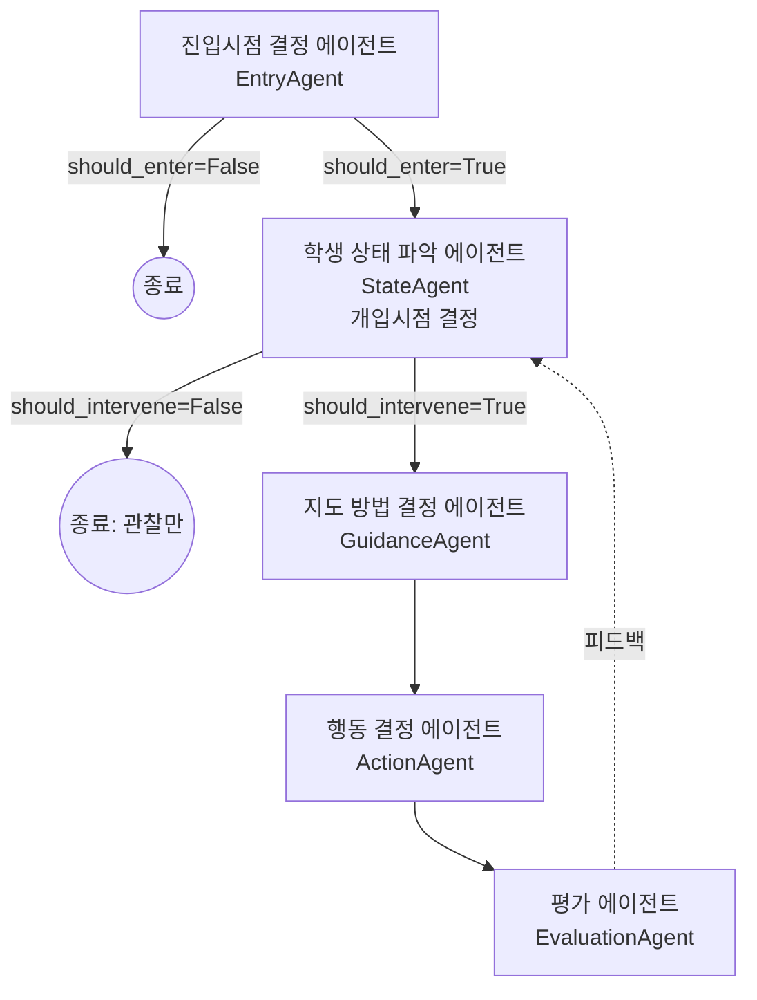

# CodeTrace / TUTORY Agent (초안)

학생이 문제를 푸는 동안 상태를 파악해 "언제, 어떻게 개입할지" 결정하고,
실제 행동을 실행한 뒤 결과를 평가하는 멀티에이전트 파이프라인 초안입니다.

- 언어/스택: **Python 3.12 + [Strands Agents SDK](https://strandsagents.com)**
- 실행 환경: **로컬 에이전트.** AWS(Bedrock) 같은 클라우드 인프라 없이, 각자 발급받은
  API 키로 LLM을 직접 호출하는 것을 기본값으로 합니다.
- LLM 프로바이더: **아직 미정.** 기본값은 Anthropic 다이렉트 API 이지만, `Agent(model=...)`
  자리만 비워두고 어떤 프로바이더로 바뀌어도 나머지 코드는 건드리지 않도록
  [`src/tutor_agent/models.py`](src/tutor_agent/models.py)에서 환경변수로 스위칭하게
  만들어 뒀습니다. (Anthropic / OpenAI / LiteLLM(로컬 Ollama 포함) 준비, 필요하면
  Bedrock으로도 옵트인 가능)

> 이 폴더는 아이디어 스케치를 코드로 옮긴 **초안**입니다. 각 에이전트의 프롬프트,
> 개입 기준, 파이프라인 분기 조건은 팀 논의로 계속 다듬어야 합니다.

## 아키텍처

원본 스케치:

```
진입시점 결정 에이전트
        |
        문제 풀이시 학생의 상태를 파악하는 에이전트 : 개입시점 결정 -> 개입시 어떻게 지도할지 에이전트
        결정을 했을 때 무엇을 해야하는지 결정하는 에이전트 -> 평가하는 에이전트
```

이 초안에서는 위 5개 노드를 **순차 파이프라인**으로 해석해서 연결했습니다
(스케치가 형제 노드처럼 보이지만, "지도 방법이 정해지면 → 무엇을 할지 결정 → 평가"로
이어지는 흐름이 자연스럽다고 판단했습니다. 실제 설계와 다르면 `orchestrator.py`의
`TutorPipeline.run()`만 고치면 됩니다):



| 단계 | 모듈 | 역할 | 출력(Pydantic) |
|---|---|---|---|
| 1 | `agents/entry_agent.py` | 지금 파이프라인을 가동할 시점인지 결정 | `EntryDecision` |
| 2 | `agents/state_agent.py` | 문제 풀이 중 학생 상태 파악 + 개입시점 결정 | `StudentState` |
| 3 | `agents/guidance_agent.py` | 개입한다면 어떻게 지도할지 결정 | `GuidancePlan` |
| 4 | `agents/action_agent.py` | 지도 방침이 정해졌을 때 실제로 무엇을 할지 결정 | `ActionPlan` |
| 5 | `agents/evaluation_agent.py` | 실행한 행동의 결과를 평가 | `Evaluation` |

공통 입력은 `schemas.py`의 `SessionContext`(학생 id, 문제 id, 현재 코드, 실행 기록,
경과/유휴 시간, 마지막 에러 등)이며, 각 단계는 이전 단계의 구조화된 출력을 이어받습니다.

## 폴더 구조

```
agent/
├── src/tutor_agent/
│   ├── schemas.py        # 파이프라인 전체가 공유하는 Pydantic 모델
│   ├── models.py         # 모델 프로바이더 스위치 (env var 기반, 미정 상태 대응)
│   ├── orchestrator.py   # 5개 에이전트를 잇는 TutorPipeline
│   ├── agents/           # 에이전트별 시스템 프롬프트 + build_agent()/실행 함수
│   └── tools/            # 에이전트가 쓸 Strands @tool 함수 (현재 예시 1개)
├── examples/run_session_demo.py   # 전체 파이프라인 실행 예시
├── tests/test_orchestrator.py     # 분기 로직 스모크 테스트 (LLM 호출 없이 mock)
├── pyproject.toml
└── .env.example
```

## 실행

```bash
cd agent
python3.12 -m venv .venv && source .venv/bin/activate
pip install -e ".[dev]"          # 기본: Anthropic 다이렉트 API 클라이언트 포함, AWS 불필요
# 다른 프로바이더를 쓴다면 extra를 같이 설치:
#   pip install -e ".[dev,openai]"
#   pip install -e ".[dev,litellm]"   # Ollama 등 완전 로컬 모델 포함

cp .env.example .env   # ANTHROPIC_API_KEY 등 API 키 채우기
python -m examples.run_session_demo
```

`.env`는 `models.py`가 import되는 시점에 `python-dotenv`로 자동 로드됩니다.
셸에서 `export`할 필요 없이 파일에 값만 채워두면 됩니다.

테스트(LLM 호출 없이 파이프라인 분기만 검증):

```bash
pytest
```

## 모델 프로바이더를 아직 안 정했을 때

`src/tutor_agent/models.py`의 `get_model(role)`이 `.env`의 `MODEL_PROVIDER`
(필요하면 에이전트별로 `MODEL_PROVIDER_ENTRY` 등)를 읽어 Strands `Model` 인스턴스를
만들어 줍니다. 아무것도 설정하지 않으면 `DEFAULT_PROVIDER`(`anthropic`)를 써서, AWS
없이 `ANTHROPIC_API_KEY`만으로 바로 돌아갑니다. 즉 **어떤 LLM으로 정해지든
`agents/*.py`는 한 줄도 안 고쳐도 됩니다** — `.env`의 `MODEL_PROVIDER`와, 필요하면
`pip install -e ".[openai|litellm]"` extra만 바꾸면 됩니다 (해당 프로바이더의 클라이언트
SDK가 그 extra에 들어 있습니다). AWS 계정을 쓰기로 팀에서 정하면
`MODEL_PROVIDER=bedrock`으로 바꾸면 되고(이 경우는 별도 extra 없이 기본 설치에
포함되어 있습니다), Strands 자체 기본 프로바이더를 쓰고 싶다면 `MODEL_PROVIDER=none`으로
두세요.

## TODO / 확인 필요

- [ ] Notion(`Agent`, `CodeTrace MVP`)의 원래 설계와 이 파이프라인 해석이 맞는지 확인
- [ ] 개입 기준(예: 유휴 시간, 연속 실패 횟수)을 실제 프로덕트 정책으로 구체화
- [ ] backend가 프런트엔드 이벤트(코드 변경/실행/제출)를 어떤 형태로 넘길지 정하고
      `SessionContext` 생성 지점을 backend 쪽에 연결
- [ ] 사용자가 문제를 해결할 때 실시간으로 에이전트가 호출되야함
