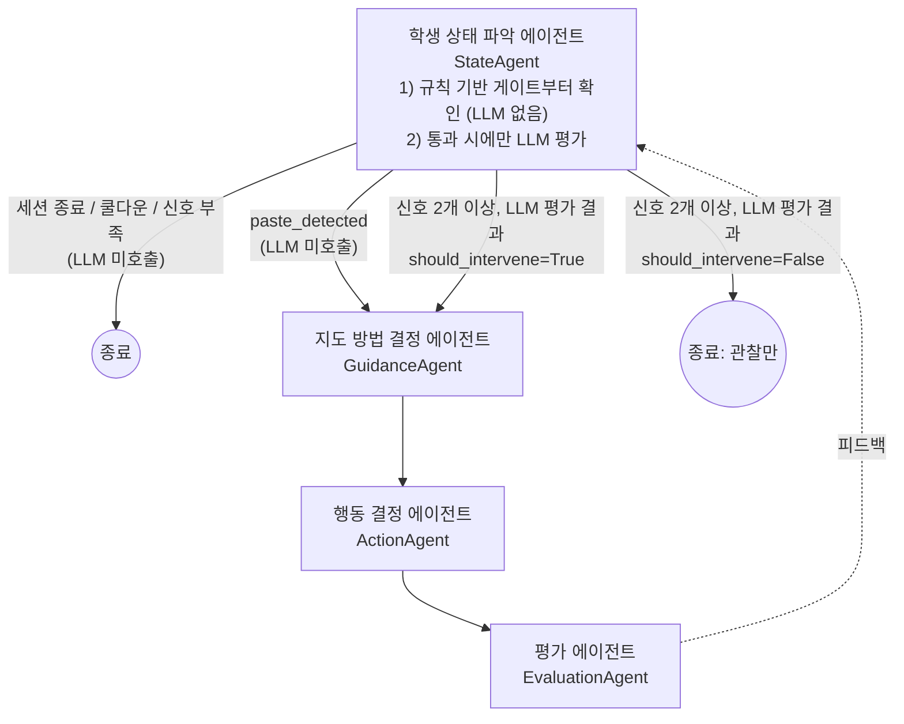

# CodeTrace / TUTORY Agent (초안)

학생이 문제를 푸는 동안 상태를 파악해 "언제, 어떻게 개입할지" 결정하고,
실제 행동을 실행한 뒤 결과를 평가하는 멀티에이전트 파이프라인 초안입니다.

- 언어/스택: **Python 3.12 + [Strands Agents SDK](https://strandsagents.com)**
- 실행 환경: **로컬 에이전트.** AWS(Bedrock) 같은 클라우드 인프라 없이, 각자 발급받은
  API 키로 LLM을 직접 호출하는 것을 기본값으로 합니다.
- LLM 프로바이더: **아직 미정.** 기본값은 Anthropic 다이렉트 API 이지만, `Agent(model=...)`
  자리만 비워두고 어떤 프로바이더로 바뀌어도 나머지 코드는 건드리지 않도록
  [`src/tutor_agent/models.py`](src/tutor_agent/models.py)에서 환경변수로 스위칭하게
  만들어 뒀습니다. (Anthropic / OpenAI / LiteLLM(로컬 Ollama 포함) 준비, 필요하면
  Bedrock으로도 옵트인 가능)

> 이 폴더는 아이디어 스케치를 코드로 옮긴 **초안**입니다. 각 에이전트의 프롬프트,
> 개입 기준, 파이프라인 분기 조건은 팀 논의로 계속 다듬어야 합니다.

## 아키텍처

원본 스케치:

```
진입시점 결정 에이전트
        |
        문제 풀이시 학생의 상태를 파악하는 에이전트 : 개입시점 결정 -> 개입시 어떻게 지도할지 에이전트
        결정을 했을 때 무엇을 해야하는지 결정하는 에이전트 -> 평가하는 에이전트
```

원래는 진입시점도 별도의 EntryAgent(LLM)가 판단했지만, StateAgent와 사실상 같은
질문("지금 뭔가 해야 하나?")을 LLM 호출 2번으로 나눠 묻는 구조였고, EntryAgent의
판단 기준("마지막 개입 이후 충분한 시간이 지났는가", "세션이 끝났는가")을 계산할
필드 자체가 `SessionContext`에 없어 실제로는 판단이 불가능했습니다. 그래서
진입시점 판단을 별도 에이전트/모듈로 두지 않고 **`agents/state_agent.py` 안에
규칙 기반 게이트(LLM 없음, 공짜)로 흡수**했습니다: 게이트를 통과한 경우에만
`state_agent.assess()`가 LLM을 호출합니다. 체크 주기마다 대부분 "아직 개입
아님"으로 끝나기 때문에 LLM 호출 절감 효과가 큽니다.

붙여넣기(`paste_detected`)는 "막힘" 신호가 아니라 성격이 달라(외부에서 답을 그대로
복사했을 수도 있음), 힌트 분기가 아닌 **"이해도 확인" 분기**로 별도 처리합니다.
게이트가 이를 감지하면 `state_agent.assess()`는 LLM을 호출하지 않고 곧장
`entry_branch="paste"`인 `StudentState`를 만들어 GuidanceAgent로 넘기고,
GuidanceAgent가 "이 코드가 왜 이렇게 동작하는지 설명해볼래요?" 같은 질문을
만들게 합니다.



| 단계 | 모듈 | 역할 | 출력(Pydantic) |
|---|---|---|---|
| 1 | `agents/state_agent.py` | 규칙 기반 게이트로 먼저 거르고, 통과 시에만 LLM으로 학생 상태 파악 + 개입시점 결정 | `StudentState` |
| 2 | `agents/guidance_agent.py` | 개입한다면 어떻게 지도할지 결정 | `GuidancePlan` |
| 3 | `agents/action_agent.py` | 지도 방침이 정해졌을 때 실제로 무엇을 할지 결정 | `ActionPlan` |
| 4 | `agents/evaluation_agent.py` | 실행한 행동의 결과를 평가 | `Evaluation` |

공통 입력은 `schemas.py`의 `SessionContext`(학생 id, 문제 id, 현재 코드, 실행 기록,
경과/유휴 시간, 마지막 에러 등)이며, 각 단계는 이전 단계의 구조화된 출력을 이어받습니다.
`StudentState.entry_branch`(`struggle` / `paste` / `skip`)를 보면 이 판단이 규칙
게이트의 어느 경로로 나왔는지 알 수 있습니다.

### `state_agent.py`의 규칙 기반 게이트 조건

신호 하나만으로 트리거하면 오탐이 많습니다(예: 유휴 60초는 그냥 문제를 읽는
중일 수도 있음). **아래 신호 중 2개 이상(`STATE_GATE_MIN_STRUGGLE_SIGNALS`)이
겹칠 때만** LLM 평가로 넘어갑니다(`struggle` 분기). 붙여넣기(`paste`)는 예외적으로
그 자체만으로 통과합니다(단, LLM은 호출하지 않습니다).

| 신호 | 조건 (기본값) | 근거 필드 |
|---|---|---|
| `idle` | 유휴 60초 이상 | `idle_seconds` |
| `cursor_stuck` | 같은 블록에 90초 이상 정체 | `cursor_stuck_seconds` (프런트 계산) |
| `edit_churn` | 같은 부분 작성→삭제 3회 이상 | `edit_churn_count` (프런트 계산) |
| `repeated_failure` | Run/Submit 연속 동일 실패 2회 이상 | `run_history` |

그 외에도 다음 조건이면 무조건 LLM 호출 없이 스킵합니다:
- `session_ended=True` (세션 종료)
- `seconds_since_last_intervention`이 쿨다운(기본 300초) 미만 (너무 잦은 개입 방지)

임계값은 모두 `.env`의 `STATE_GATE_*` 환경변수로 조정할 수 있습니다
(`.env.example` 참고).

> **힌트 버튼**(학생이 직접 요청)은 이 자동 게이트와 무관하게 항상 살려두는 것을
> 권장합니다 — 자동 감지가 놓쳐도 학생이 스스로 요청할 수 있는 탈출구입니다.
> (버튼 자체는 backend/frontend 쪽 구현이며 이 파이프라인은 자동 개입만 다룹니다.)

## 폴더 구조

```
agent/
├── src/tutor_agent/
│   ├── schemas.py        # 파이프라인 전체가 공유하는 Pydantic 모델
│   ├── models.py         # 모델 프로바이더 스위치 (env var 기반, 미정 상태 대응)
│   ├── orchestrator.py   # 4개 에이전트를 잇는 TutorPipeline
│   ├── agents/            # 에이전트별 시스템 프롬프트 + build_agent()/실행 함수
│   │   └── state_agent.py # 규칙 기반 진입 게이트(LLM 없음) + 학생 상태 파악(LLM)
│   └── tools/             # 에이전트가 쓸 Strands @tool 함수 (현재 예시 1개)
├── examples/run_session_demo.py   # 전체 파이프라인 실행 예시 (struggle/skip/paste 3종)
├── tests/
│   ├── test_state_agent.py    # 규칙 게이트 + assess() 분기 테스트 (LLM 없음, mock)
│   └── test_orchestrator.py   # 분기 로직 스모크 테스트 (LLM 호출 없이 mock)
├── pyproject.toml
└── .env.example
```

## 실행

```bash
cd agent
python3.12 -m venv .venv && source .venv/bin/activate
pip install -e ".[dev]"          # 기본: Anthropic 다이렉트 API 클라이언트 포함, AWS 불필요
# 다른 프로바이더를 쓴다면 extra를 같이 설치:
#   pip install -e ".[dev,openai]"
#   pip install -e ".[dev,litellm]"   # Ollama 등 완전 로컬 모델 포함

cp .env.example .env   # ANTHROPIC_API_KEY 등 API 키 채우기
python -m examples.run_session_demo
```

`.env`는 `models.py`가 import되는 시점에 `python-dotenv`로 자동 로드됩니다.
셸에서 `export`할 필요 없이 파일에 값만 채워두면 됩니다.

테스트(LLM 호출 없이 파이프라인 분기만 검증):

```bash
pytest
```

## 모델 프로바이더를 아직 안 정했을 때

`src/tutor_agent/models.py`의 `get_model(role)`이 `.env`의 `MODEL_PROVIDER`
(필요하면 에이전트별로 `MODEL_PROVIDER_STATE` 등)를 읽어 Strands `Model` 인스턴스를
만들어 줍니다. 진입시점 판단(`state_agent.py`의 규칙 게이트)은 LLM을 쓰지 않으므로
여기 해당하지 않습니다. 아무것도 설정하지 않으면 `DEFAULT_PROVIDER`(`anthropic`)를 써서, AWS
없이 `ANTHROPIC_API_KEY`만으로 바로 돌아갑니다. 즉 **어떤 LLM으로 정해지든
`agents/*.py`는 한 줄도 안 고쳐도 됩니다** — `.env`의 `MODEL_PROVIDER`와, 필요하면
`pip install -e ".[openai|litellm]"` extra만 바꾸면 됩니다 (해당 프로바이더의 클라이언트
SDK가 그 extra에 들어 있습니다). AWS 계정을 쓰기로 팀에서 정하면
`MODEL_PROVIDER=bedrock`으로 바꾸면 되고(이 경우는 별도 extra 없이 기본 설치에
포함되어 있습니다), Strands 자체 기본 프로바이더를 쓰고 싶다면 `MODEL_PROVIDER=none`으로
두세요.

## TODO / 확인 필요

- [ ] Notion(`Agent`, `CodeTrace MVP`)의 원래 설계와 이 파이프라인 해석이 맞는지 확인
- [x] 개입 기준(유휴 시간, 연속 실패 횟수 등)을 `state_agent.py`의 규칙 기반
      게이트로 구체화 — 실제 서비스 데이터로 임계값(`STATE_GATE_*`)은 계속 튜닝 필요
- [ ] `edit_churn_count`, `cursor_stuck_seconds`, `paste_detected`를 프런트엔드에서
      실제로 계산해 backend를 거쳐 `SessionContext`로 채우는 연동 구현
- [ ] backend가 프런트엔드 이벤트(코드 변경/실행/제출)를 어떤 형태로 넘길지 정하고
      `SessionContext` 생성 지점을 backend 쪽에 연결
- [ ] 사용자가 문제를 해결할 때 실시간으로 에이전트가 호출되야함
- [ ] "힌트 버튼"(학생 직접 요청) 경로를 backend/frontend에 구현 — state_agent의
      규칙 게이트와 무관하게 항상 열려 있어야 함
